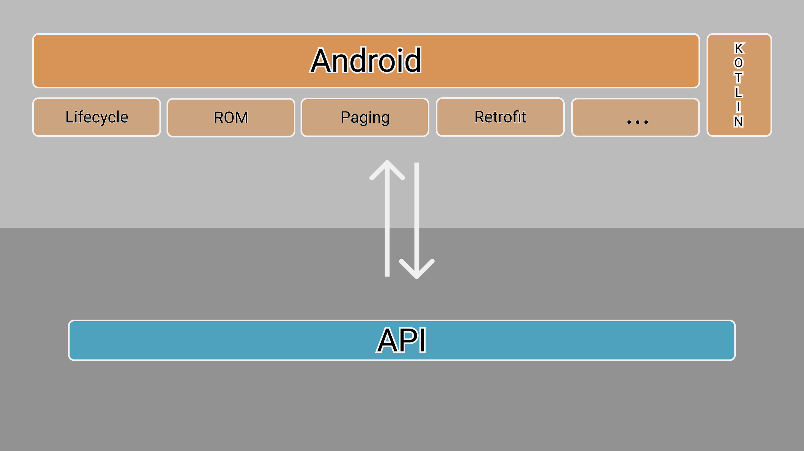

# Content

[1 - Description](#description)

[2 - IDE](#ide)

[3 - Objective](#objective)

[4 - Overview](#overview)

[5 - Composition](#composition)

[6 - Run](#run)

[7 - Requirements](#requirements)

[8 - Usage](#usage)

[9 - References](#references)

[10 - Contact](#contact)

[11 - Forthcoming Work](#forthcoming-work)

[12 - Buy me a coffee](#buy-me-a-coffee-)

# Description

-   Das Auto APP

# IDE

- Android Studio 3.5 Beta 5
- Build #AI-191.7479.19.35.5675373, built on June 20, 2019
- JRE: 1.8.0_202-release-1483-b49-5587405 x86_64
- JVM: OpenJDK 64-Bit Server VM by JetBrains s.r.o
- macOS 10.14.5

# Objective

  - Learn about Android Jetpacks's libraries

# Overview

# Composition

  - kotlin = 1.3.41
  - retrofit = 2.6.0
  - spinkit = 1.2.0
  - converter gson = 2.6.0
  - lifecycle = 2.2.0-alpha02
  - recycler view = 1.0.0
  - navigation fragment = 1.0.0
  - navigation fragment ktx = 2.1.0-alpha06
  - navigation ui = 2.0.0
  - fragment ktx = 1.0.0
  - safe args = 1.0.0-alpha11
  - core ktx = 1.0.2
  - room = 2.1.0
  - interceptor = 3.8.0
  - core testing = 2.0.1
  - espresso core = 3.2.0
  - paging runtime = 2.1.0-rc01

# Run

  -   Clone this repository and open build.gradle with Android Studio

# Requirements

  - minSdkVersion 16
  - targetSdkVersion 28

# Usage

  - N/A

#   References

  - Many references were used during this learning process. Still, only was question was generated on Stack Overflow.

  - [MutableLiveData not updating after fetching on ROM database](https://stackoverflow.com/questions/57132940/mutablelivedata-wont-trigger-loadafter-to-fetch-from-android-rom-using-pagedlis)

#   Contact

- roliveira.victor@gmail.com

#   Forthcoming Work

- PageKeyedDataSource implementation for API calling

#   Buy me a coffee ;)

